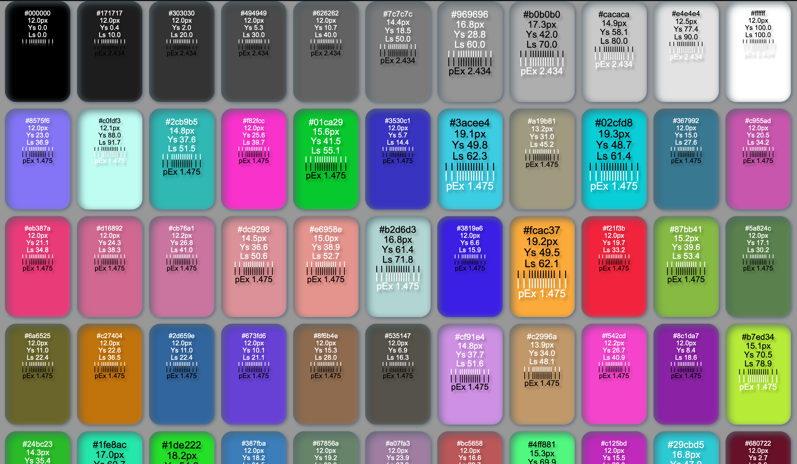

# Fancy Font Flipping
Fancy Font Flipping is a demo I first put up in CodePen to illustrate the issues with flipping the text color from black to white based on a given estimated background luminance. For details and explainations, please [see this Gist](https://gist.github.com/Myndex/e1025706436736166561d339fd667493#lets-flip-for-color) that briefly describes the science behind all of this. The index.html file here contains the CSS and JS, and is viewable [live on this link.](https://myndex.github.io/fancyfontflipping/)

## Features
- Flips font color from black to white, depending on background
- Adjusts font size based on resultant contrast.
- Secondary sample text in opposite color
- Color picker to set the overall background.

The live CodePen is https://codepen.io/myndex/pen/GRyxrrm

There are a number of constants you can adjust to see how different levels of luminance *or* percepual lightness affect the readability of the text. In conjuction with this, near the middle range, the font is increased in size. This is because small fonts need more contrast than is available between the actual middle contrast (on an sRGB monitor) and either black or white. 

### Related Repo: APCA - Accessible Perceptual Contrat Algorithm
The [SAPC-APCA Repo on GitHub](https://github.com/Myndex/SAPC-APCA/tree/master/documentation) APCA is a perceptually uniform contrat prediction method and the candidate method for WCAG 3.

### Example Output

